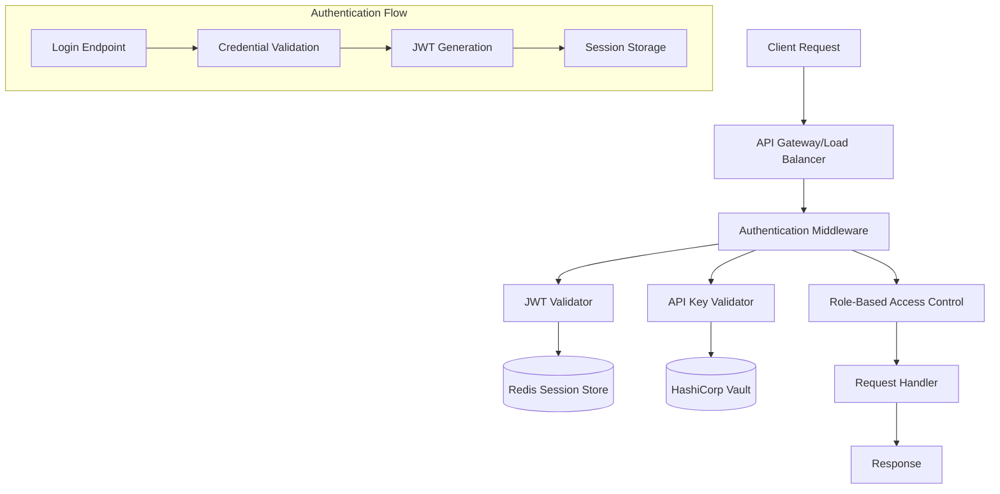
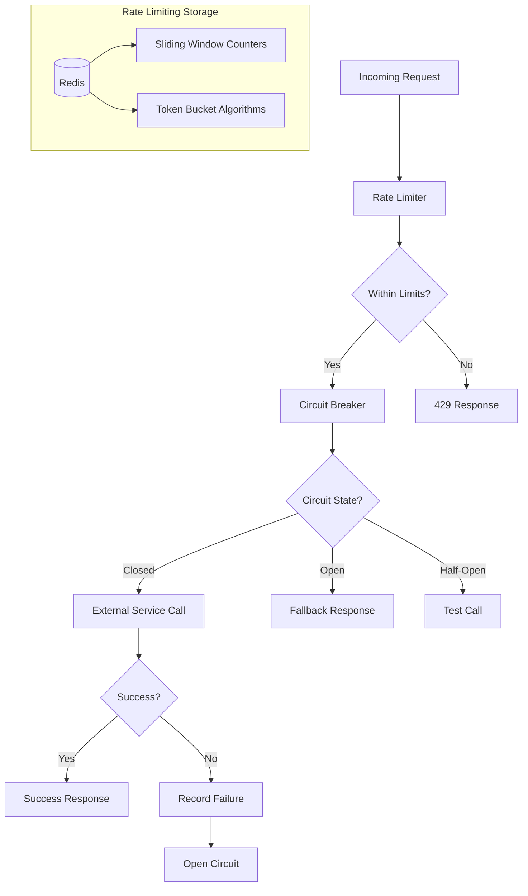
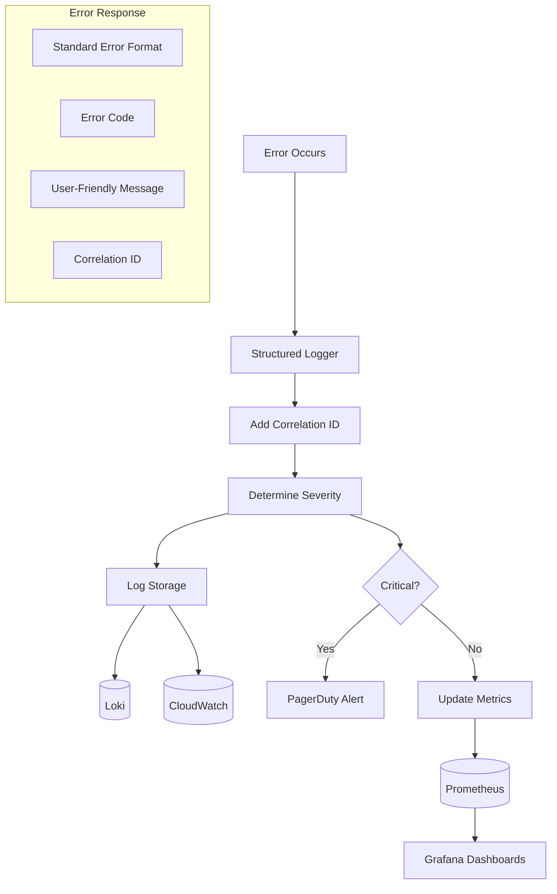

# Production Readiness & Security Hardening - Design

## Overview

This design document outlines the implementation approach for making VoiceHive Hotels production-ready by addressing critical security, performance, and reliability gaps. The design focuses on adding essential production features while maintaining the existing excellent architecture and ensuring minimal disruption to current functionality.

## Architecture

### Authentication & Authorization Architecture



### Rate Limiting & Circuit Breaker Architecture



### Error Handling & Monitoring Architecture



## Components and Interfaces

### 1. Authentication Middleware

```python
class AuthenticationMiddleware:
    """JWT and API Key authentication middleware"""

    async def __call__(self, request: Request, call_next):
        # Extract token from Authorization header
        # Validate JWT or API key
        # Set user context
        # Call next middleware
        pass

    async def validate_jwt(self, token: str) -> UserContext:
        # Validate JWT signature and expiration
        # Check against Redis session store
        # Return user context with roles
        pass

    async def validate_api_key(self, api_key: str) -> ServiceContext:
        # Validate API key against Vault
        # Check permissions and rate limits
        # Return service context
        pass
```

### 2. Rate Limiting Middleware

```python
class RateLimitMiddleware:
    """Redis-based sliding window rate limiter"""

    def __init__(self, redis_client: Redis):
        self.redis = redis_client
        self.algorithms = {
            'sliding_window': SlidingWindowRateLimiter,
            'token_bucket': TokenBucketRateLimiter,
            'fixed_window': FixedWindowRateLimiter
        }

    async def check_rate_limit(self, key: str, limit: int, window: int) -> RateLimitResult:
        # Implement sliding window algorithm
        # Return current usage and remaining quota
        pass
```

### 3. Circuit Breaker Implementation

```python
class CircuitBreaker:
    """Hystrix-style circuit breaker with exponential backoff"""

    def __init__(self, failure_threshold: int = 5, timeout: int = 60):
        self.state = CircuitState.CLOSED
        self.failure_count = 0
        self.last_failure_time = None
        self.failure_threshold = failure_threshold
        self.timeout = timeout

    async def call(self, func: Callable, *args, **kwargs):
        if self.state == CircuitState.OPEN:
            if self._should_attempt_reset():
                self.state = CircuitState.HALF_OPEN
            else:
                raise CircuitBreakerOpenError()

        try:
            result = await func(*args, **kwargs)
            self._on_success()
            return result
        except Exception as e:
            self._on_failure()
            raise
```

### 4. Standardized Error Handler

```python
class ErrorHandler:
    """Centralized error handling with structured responses"""

    def __init__(self, logger: Logger):
        self.logger = logger
        self.error_mappings = {
            ValidationError: (400, "VALIDATION_ERROR"),
            AuthenticationError: (401, "AUTHENTICATION_ERROR"),
            AuthorizationError: (403, "AUTHORIZATION_ERROR"),
            NotFoundError: (404, "NOT_FOUND"),
            RateLimitError: (429, "RATE_LIMIT_EXCEEDED"),
            CircuitBreakerOpenError: (503, "SERVICE_UNAVAILABLE")
        }

    async def handle_error(self, error: Exception, request: Request) -> JSONResponse:
        correlation_id = request.headers.get("X-Correlation-ID", str(uuid4()))

        # Log error with context
        self.logger.error(
            "request_error",
            error=str(error),
            error_type=type(error).__name__,
            correlation_id=correlation_id,
            path=request.url.path,
            method=request.method
        )

        # Map to standard response
        status_code, error_code = self.error_mappings.get(
            type(error), (500, "INTERNAL_ERROR")
        )

        return JSONResponse(
            status_code=status_code,
            content={
                "error": {
                    "code": error_code,
                    "message": self._get_user_message(error),
                    "correlation_id": correlation_id,
                    "timestamp": datetime.utcnow().isoformat()
                }
            }
        )
```

### 5. Performance Optimization Components

```python
class ConnectionPoolManager:
    """Centralized connection pool management"""

    def __init__(self):
        self.db_pool = None
        self.redis_pool = None
        self.http_session = None

    async def initialize(self):
        # Initialize database connection pool
        self.db_pool = await asyncpg.create_pool(
            DATABASE_URL,
            min_size=5,
            max_size=20,
            command_timeout=30
        )

        # Initialize Redis connection pool
        self.redis_pool = aioredis.ConnectionPool.from_url(
            REDIS_URL,
            max_connections=20
        )

        # Initialize HTTP session with connection pooling
        connector = aiohttp.TCPConnector(
            limit=100,
            limit_per_host=30,
            keepalive_timeout=30
        )
        self.http_session = aiohttp.ClientSession(connector=connector)
```

## Data Models

### Authentication Models

```python
class UserContext(BaseModel):
    user_id: str
    email: str
    roles: List[str]
    permissions: List[str]
    session_id: str
    expires_at: datetime

class ServiceContext(BaseModel):
    service_name: str
    api_key_id: str
    permissions: List[str]
    rate_limits: Dict[str, int]

class JWTPayload(BaseModel):
    sub: str  # user_id
    email: str
    roles: List[str]
    iat: int
    exp: int
    jti: str  # JWT ID for revocation
```

### Rate Limiting Models

```python
class RateLimitConfig(BaseModel):
    requests_per_minute: int = 60
    requests_per_hour: int = 1000
    requests_per_day: int = 10000
    burst_limit: int = 10
    algorithm: str = "sliding_window"

class RateLimitResult(BaseModel):
    allowed: bool
    current_usage: int
    remaining: int
    reset_time: datetime
    retry_after: Optional[int] = None
```

### Error Response Models

```python
class ErrorResponse(BaseModel):
    error: ErrorDetail

class ErrorDetail(BaseModel):
    code: str
    message: str
    correlation_id: str
    timestamp: str
    details: Optional[Dict[str, Any]] = None
```

## Error Handling

### Error Classification

1. **Client Errors (4xx)**

   - Validation errors
   - Authentication failures
   - Authorization failures
   - Rate limit exceeded

2. **Server Errors (5xx)**

   - Internal server errors
   - External service failures
   - Database connection errors
   - Circuit breaker open

3. **Business Logic Errors**
   - PMS connector failures
   - Invalid hotel operations
   - Data consistency issues

### Retry Strategy

```python
class RetryConfig:
    max_attempts: int = 3
    base_delay: float = 1.0
    max_delay: float = 60.0
    exponential_base: float = 2.0
    jitter: bool = True

    retryable_errors = [
        ConnectionError,
        TimeoutError,
        HTTPStatusError  # for 5xx responses
    ]

    non_retryable_errors = [
        AuthenticationError,
        ValidationError,
        NotFoundError
    ]
```

## Testing Strategy

### Unit Testing

- Test all middleware components in isolation
- Mock external dependencies
- Validate error handling paths
- Test rate limiting algorithms

### Integration Testing

- End-to-end authentication flows
- Rate limiting under load
- Circuit breaker behavior
- Error propagation across services

### Load Testing

- Concurrent authentication requests
- Rate limiting effectiveness
- Circuit breaker performance
- Memory usage under load

### Security Testing

- JWT token validation
- API key security
- Input validation effectiveness
- Audit logging completeness

### Chaos Engineering

- Database connection failures
- Redis unavailability
- External service timeouts
- Network partitions

## Performance Considerations

### Connection Pooling

- Database: 5-20 connections per service
- Redis: 10-20 connections per service
- HTTP: 30 connections per host, 100 total

### Caching Strategy

- JWT validation results: 5-minute TTL
- Rate limit counters: Sliding window in Redis
- Circuit breaker state: In-memory with Redis backup
- API responses: Configurable TTL per endpoint

### Memory Management

- Connection pool limits
- Circuit breaker state cleanup
- Log buffer management
- Metric collection optimization

## Security Considerations

### JWT Security

- RS256 algorithm with rotating keys
- Short expiration times (15 minutes)
- Refresh token mechanism
- Revocation support via Redis blacklist

### API Key Security

- Stored in HashiCorp Vault
- Scoped permissions
- Usage tracking and alerting
- Regular rotation schedule

### Input Validation

- Pydantic models for all inputs
- SQL injection prevention
- XSS protection
- File upload restrictions

### Audit Logging

- All authentication events
- Authorization failures
- Data access operations
- Configuration changes
- Administrative actions

## Deployment Strategy

### Phase 1: Core Security (Week 1-2)

- Authentication middleware
- Basic rate limiting
- Error handling standardization
- Security headers

### Phase 2: Performance & Reliability (Week 3-4)

- Connection pooling
- Circuit breakers
- Advanced rate limiting
- Monitoring enhancements

### Phase 3: Advanced Features (Week 5-6)

- Comprehensive testing
- Documentation completion
- Performance optimization
- Security hardening

### Rollback Plan

- Feature flags for all new components
- Database migration rollback scripts
- Configuration rollback procedures
- Monitoring for regression detection
