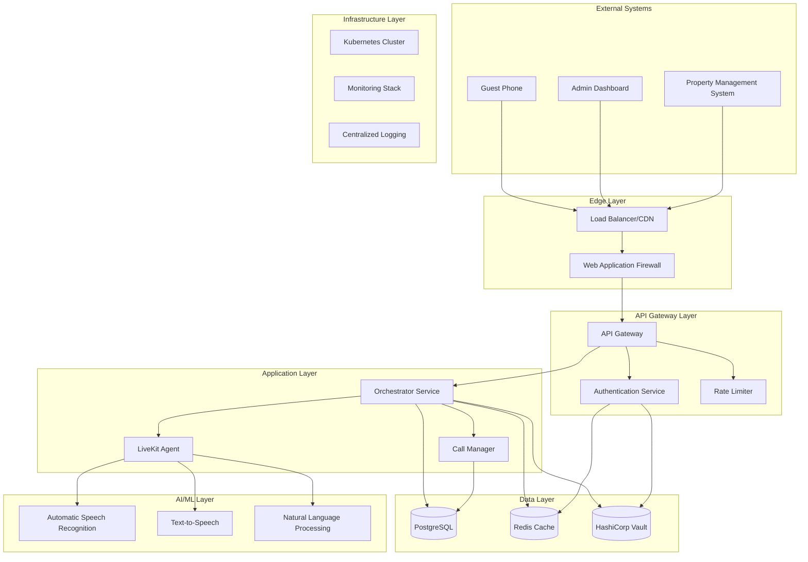
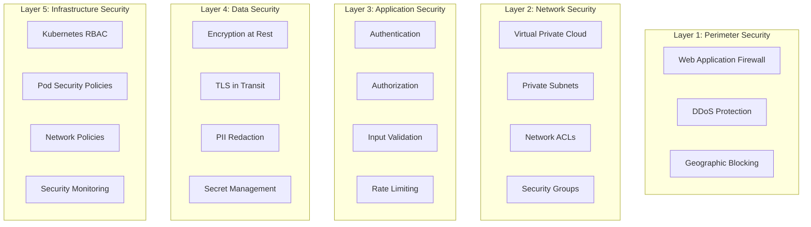
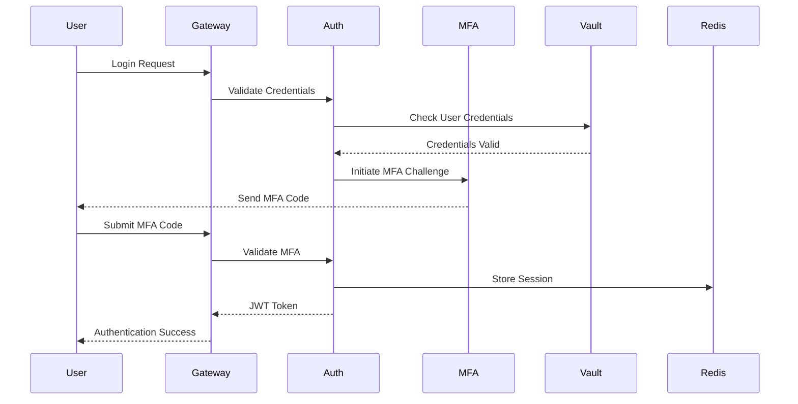
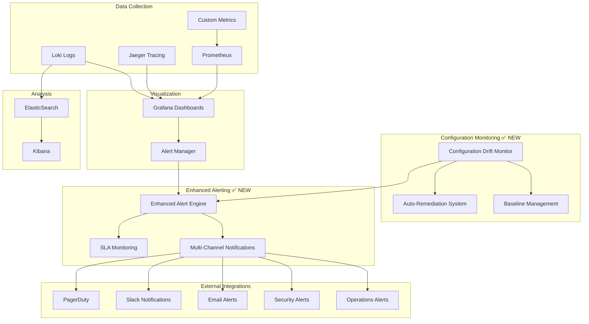
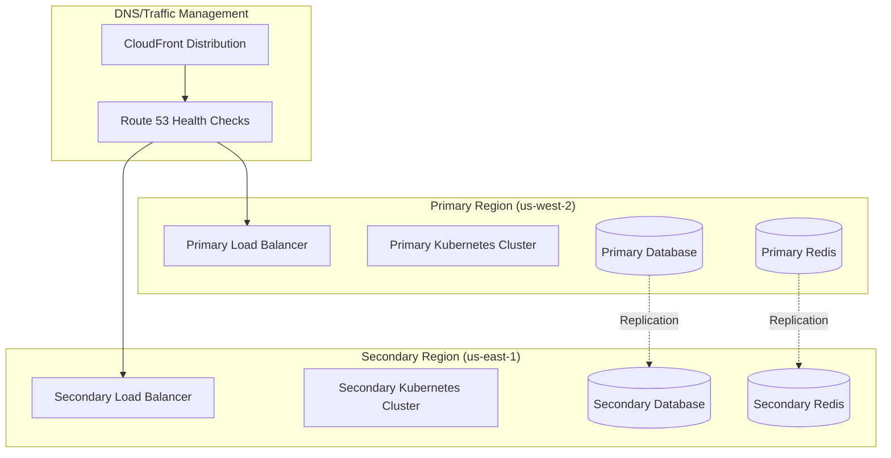
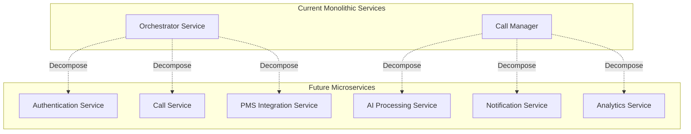

# VoiceHive Hotels System Architecture

## Overview

VoiceHive Hotels is a cloud-native voice AI platform designed for hotel guest services. The system provides intelligent voice interactions, real-time call processing, and seamless integration with Property Management Systems (PMS). This document outlines the complete system architecture, security controls, and operational considerations.

## High-Level Architecture



## Component Architecture

### 1. Edge and Security Layer

#### Load Balancer / CDN

- **Technology**: AWS Application Load Balancer + CloudFront
- **Purpose**: Traffic distribution, SSL termination, DDoS protection
- **Features**:
  - Geographic load balancing
  - Health check integration
  - SSL/TLS termination
  - Static content caching

#### Web Application Firewall (WAF)

- **Technology**: AWS WAF v2
- **Purpose**: Application-layer security filtering
- **Rules**:
  - SQL injection protection
  - XSS prevention
  - Rate limiting by IP
  - Geographic blocking
  - Bot protection

```yaml
# WAF Configuration Example
Rules:
  - Name: SQLInjectionRule
    Priority: 1
    Statement:
      SqliMatchStatement:
        FieldToMatch:
          Body: {}
        TextTransformations:
          - Priority: 0
            Type: URL_DECODE
    Action:
      Block: {}
```

### 2. API Gateway Layer

#### API Gateway

- **Technology**: Kong Gateway on Kubernetes
- **Purpose**: API management, routing, and policy enforcement
- **Features**:
  - Request/response transformation
  - API versioning
  - Circuit breaker integration
  - Metrics collection

```yaml
# Kong Gateway Configuration
apiVersion: configuration.konghq.com/v1
kind: KongIngress
metadata:
  name: voicehive-api
proxy:
  connect_timeout: 30000
  read_timeout: 30000
  write_timeout: 30000
upstream:
  healthchecks:
    active:
      healthy:
        interval: 30
        successes: 3
      unhealthy:
        interval: 30
        http_failures: 3
```

#### Authentication Service

- **Technology**: Custom FastAPI service with JWT
- **Purpose**: User authentication and authorization
- **Components**:
  - JWT token management
  - API key validation
  - Role-based access control (RBAC)
  - Session management

```python
# Authentication Architecture
class AuthenticationService:
    def __init__(self):
        self.jwt_service = JWTService()
        self.vault_client = VaultClient()
        self.redis_client = RedisClient()

    async def authenticate_jwt(self, token: str) -> UserContext:
        # JWT validation and user context extraction
        pass

    async def authenticate_api_key(self, api_key: str) -> ServiceContext:
        # API key validation against Vault
        pass
```

### 3. Application Services Layer

#### Orchestrator Service

- **Technology**: FastAPI with async/await
- **Purpose**: Main business logic coordination
- **Responsibilities**:
  - Call lifecycle management
  - PMS integration coordination
  - Business rule enforcement
  - Event orchestration

```python
# Orchestrator Service Structure
class OrchestratorService:
    def __init__(self):
        self.call_manager = CallManager()
        self.pms_connector = PMSConnectorFactory()
        self.event_bus = EventBus()
        self.metrics_collector = MetricsCollector()

    async def handle_call_request(self, request: CallRequest) -> CallResponse:
        # Coordinate call setup with all required services
        pass
```

#### Call Manager

- **Technology**: Python with LiveKit SDK
- **Purpose**: Real-time call handling and coordination
- **Features**:
  - WebRTC session management
  - Audio stream processing
  - Call state management
  - Recording and transcription

#### LiveKit Agent

- **Technology**: LiveKit Python SDK
- **Purpose**: Real-time voice processing
- **Components**:
  - Voice Activity Detection (VAD)
  - Audio preprocessing
  - AI model integration
  - Real-time response generation

### 4. AI/ML Processing Layer

#### Automatic Speech Recognition (ASR)

- **Technology**: NVIDIA Riva + Whisper fallback
- **Purpose**: Convert speech to text
- **Features**:
  - Real-time streaming recognition
  - Multiple language support
  - Noise reduction
  - Confidence scoring

```yaml
# Riva ASR Configuration
apiVersion: apps/v1
kind: Deployment
metadata:
  name: riva-asr-proxy
spec:
  replicas: 3
  template:
    spec:
      containers:
        - name: riva-proxy
          image: voicehive/riva-proxy:latest
          resources:
            requests:
              memory: "2Gi"
              cpu: "1000m"
              nvidia.com/gpu: 1
            limits:
              memory: "4Gi"
              cpu: "2000m"
              nvidia.com/gpu: 1
```

#### Text-to-Speech (TTS)

- **Technology**: Azure Cognitive Services + ElevenLabs
- **Purpose**: Convert text responses to natural speech
- **Features**:
  - Multiple voice options
  - Emotion and tone control
  - SSML support
  - Caching for common responses

#### Natural Language Processing (NLP)

- **Technology**: OpenAI GPT-4 + Custom models
- **Purpose**: Intent recognition and response generation
- **Components**:
  - Intent classification
  - Entity extraction
  - Context management
  - Response generation

### 5. Data Layer

#### PostgreSQL Database

- **Technology**: PostgreSQL 15 with pgBouncer
- **Purpose**: Primary data storage
- **Schema Design**:

```sql
-- Core Tables
CREATE TABLE hotels (
    id UUID PRIMARY KEY DEFAULT gen_random_uuid(),
    name VARCHAR(255) NOT NULL,
    pms_type VARCHAR(50) NOT NULL,
    config JSONB,
    created_at TIMESTAMP WITH TIME ZONE DEFAULT NOW()
);

CREATE TABLE calls (
    id UUID PRIMARY KEY DEFAULT gen_random_uuid(),
    hotel_id UUID REFERENCES hotels(id),
    room_number VARCHAR(20),
    guest_name VARCHAR(255),
    status VARCHAR(50) NOT NULL,
    started_at TIMESTAMP WITH TIME ZONE,
    ended_at TIMESTAMP WITH TIME ZONE,
    transcript TEXT,
    summary TEXT,
    pii_redacted BOOLEAN DEFAULT false,
    created_at TIMESTAMP WITH TIME ZONE DEFAULT NOW()
);

CREATE TABLE audit_log (
    id UUID PRIMARY KEY DEFAULT gen_random_uuid(),
    user_id UUID,
    action VARCHAR(100) NOT NULL,
    resource_type VARCHAR(50),
    resource_id UUID,
    ip_address INET,
    user_agent TEXT,
    details JSONB,
    created_at TIMESTAMP WITH TIME ZONE DEFAULT NOW()
);
```

#### Redis Cache

- **Technology**: Redis 7 with Redis Sentinel
- **Purpose**: Caching and session storage
- **Use Cases**:
  - JWT token blacklist
  - Rate limiting counters
  - Session storage
  - Circuit breaker state
  - Temporary data caching

```yaml
# Redis Configuration
apiVersion: v1
kind: ConfigMap
metadata:
  name: redis-config
data:
  redis.conf: |
    maxmemory 2gb
    maxmemory-policy allkeys-lru
    save 900 1
    save 300 10
    save 60 10000
```

#### HashiCorp Vault

- **Technology**: Vault Enterprise
- **Purpose**: Secrets management and encryption
- **Stored Secrets**:
  - Database credentials
  - API keys and tokens
  - TLS certificates
  - Encryption keys
  - PMS integration credentials

```hcl
# Vault Policy Example
path "secret/data/voicehive/*" {
  capabilities = ["read"]
}

path "secret/data/pms/*" {
  capabilities = ["read", "update"]
}

path "auth/kubernetes/login" {
  capabilities = ["create", "update"]
}
```

## Security Architecture

### 1. Defense in Depth



### 2. Authentication and Authorization

#### Multi-Factor Authentication Flow



#### Role-Based Access Control (RBAC)

```yaml
# Kubernetes RBAC Configuration
apiVersion: rbac.authorization.k8s.io/v1
kind: Role
metadata:
  namespace: voicehive
  name: voicehive-operator
rules:
  - apiGroups: [""]
    resources: ["pods", "services", "configmaps"]
    verbs: ["get", "list", "watch", "create", "update", "patch"]
  - apiGroups: ["apps"]
    resources: ["deployments", "replicasets"]
    verbs: ["get", "list", "watch", "create", "update", "patch"]
```

### 3. Data Protection

#### Encryption Strategy

**Encryption at Rest:**

- Database: AES-256 encryption
- File storage: AWS S3 with KMS
- Secrets: Vault transit engine
- Backups: Encrypted with customer-managed keys

**Encryption in Transit:**

- TLS 1.3 for all external communications
- mTLS for internal service communication
- VPN for administrative access
- Encrypted database connections

#### PII Redaction System

```python
class PIIRedactor:
    def __init__(self):
        self.patterns = {
            'phone': r'\b\d{3}-\d{3}-\d{4}\b',
            'email': r'\b[A-Za-z0-9._%+-]+@[A-Za-z0-9.-]+\.[A-Z|a-z]{2,}\b',
            'ssn': r'\b\d{3}-\d{2}-\d{4}\b',
            'credit_card': r'\b\d{4}[-\s]?\d{4}[-\s]?\d{4}[-\s]?\d{4}\b'
        }

    def redact_text(self, text: str) -> str:
        for pii_type, pattern in self.patterns.items():
            text = re.sub(pattern, f'[REDACTED_{pii_type.upper()}]', text)
        return text
```

### 4. Network Security

#### Network Segmentation

```yaml
# Network Policy Example
apiVersion: networking.k8s.io/v1
kind: NetworkPolicy
metadata:
  name: voicehive-network-policy
  namespace: voicehive
spec:
  podSelector:
    matchLabels:
      app: orchestrator
  policyTypes:
    - Ingress
    - Egress
  ingress:
    - from:
        - namespaceSelector:
            matchLabels:
              name: voicehive
        - podSelector:
            matchLabels:
              app: api-gateway
      ports:
        - protocol: TCP
          port: 8000
  egress:
    - to:
        - namespaceSelector:
            matchLabels:
              name: voicehive
      ports:
        - protocol: TCP
          port: 5432 # PostgreSQL
        - protocol: TCP
          port: 6379 # Redis
```

## Scalability and Performance

### 1. Horizontal Scaling Strategy

#### Auto-scaling Configuration

```yaml
apiVersion: autoscaling/v2
kind: HorizontalPodAutoscaler
metadata:
  name: orchestrator-hpa
  namespace: voicehive
spec:
  scaleTargetRef:
    apiVersion: apps/v1
    kind: Deployment
    name: orchestrator
  minReplicas: 3
  maxReplicas: 50
  metrics:
    - type: Resource
      resource:
        name: cpu
        target:
          type: Utilization
          averageUtilization: 70
    - type: Resource
      resource:
        name: memory
        target:
          type: Utilization
          averageUtilization: 80
    - type: Pods
      pods:
        metric:
          name: http_requests_per_second
        target:
          type: AverageValue
          averageValue: "100"
```

### 2. Performance Optimization

#### Connection Pooling

```python
class ConnectionPoolManager:
    def __init__(self):
        self.db_pool = None
        self.redis_pool = None
        self.http_session = None

    async def initialize(self):
        # Database connection pool
        self.db_pool = await asyncpg.create_pool(
            DATABASE_URL,
            min_size=10,
            max_size=50,
            command_timeout=30,
            server_settings={
                'application_name': 'voicehive-orchestrator',
                'jit': 'off'
            }
        )

        # Redis connection pool
        self.redis_pool = aioredis.ConnectionPool.from_url(
            REDIS_URL,
            max_connections=50,
            retry_on_timeout=True
        )

        # HTTP session with connection pooling
        connector = aiohttp.TCPConnector(
            limit=200,
            limit_per_host=50,
            keepalive_timeout=30,
            enable_cleanup_closed=True
        )
        self.http_session = aiohttp.ClientSession(
            connector=connector,
            timeout=aiohttp.ClientTimeout(total=30)
        )
```

#### Caching Strategy

```python
class IntelligentCache:
    def __init__(self, redis_client):
        self.redis = redis_client
        self.cache_configs = {
            'user_profile': {'ttl': 3600, 'prefix': 'user:'},
            'hotel_config': {'ttl': 7200, 'prefix': 'hotel:'},
            'pms_data': {'ttl': 300, 'prefix': 'pms:'},
            'tts_audio': {'ttl': 86400, 'prefix': 'tts:'}
        }

    async def get_or_set(self, cache_type: str, key: str,
                        fetch_func: Callable) -> Any:
        config = self.cache_configs[cache_type]
        cache_key = f"{config['prefix']}{key}"

        # Try to get from cache
        cached_value = await self.redis.get(cache_key)
        if cached_value:
            return json.loads(cached_value)

        # Fetch and cache
        value = await fetch_func()
        await self.redis.setex(
            cache_key,
            config['ttl'],
            json.dumps(value, default=str)
        )
        return value
```

## Monitoring and Observability ✅ **ENTERPRISE-GRADE - SPRINT 0 COMPLETE**

### 1. Advanced Monitoring Stack



### 2. Configuration Drift Monitoring ✅ **NEW ENTERPRISE FEATURE**

**Technology**: Custom Python service with Redis persistence
**Purpose**: Real-time configuration change detection with auto-remediation
**Location**: `services/orchestrator/config_drift_monitor.py` (1,171 LOC)

#### Architecture
```python
class ConfigurationDriftMonitor:
    """Enterprise-grade configuration monitoring system"""

    def __init__(self, enable_auto_remediation: bool = False):
        self.baseline_storage_path = Path("/var/lib/voicehive/config-baselines")
        self.check_interval_seconds = 300  # 5 minutes
        self.enable_auto_remediation = enable_auto_remediation
        self._drift_rules = self._initialize_drift_rules()

    async def check_drift(self, current_config: VoiceHiveConfig) -> List[DriftDetection]:
        """Check for configuration drift against baseline"""
        # Real-time drift detection with severity classification

    async def _execute_auto_remediation(self, critical_drifts: List[DriftDetection]):
        """Automatic remediation for critical configuration drifts"""
        # Multi-strategy remediation with comprehensive error handling
```

#### Key Features
- **Real-time Monitoring**: Continuous configuration change detection
- **Security Focus**: Critical security downgrade detection
- **Auto-Remediation**: Automated restoration of critical configurations
- **Multi-Channel Alerts**: Integration with all notification systems
- **Audit Integration**: Comprehensive audit trail for all changes
- **Baseline Management**: Automated baseline creation and validation

### 3. Enhanced Alerting System ✅ **NEW ENTERPRISE FEATURE**

**Technology**: Async Python with multi-channel integration
**Purpose**: Enterprise-grade alerting with SLA monitoring
**Location**: `services/orchestrator/enhanced_alerting.py` (708 LOC)

#### Multi-Channel Architecture
```python
class EnhancedAlertingSystem:
    """Advanced alerting with SLA monitoring"""

    def __init__(self):
        self.alert_rules: Dict[str, AlertRule] = {}
        self.sla_targets: Dict[str, SLATarget] = {}
        self.notification_channels: List[NotificationChannel] = []

    async def evaluate_alert_rules(self):
        """Evaluate all configured alert rules"""

    async def evaluate_sla_targets(self):
        """Monitor SLA compliance and violations"""
```

#### Notification Channels
```python
# Slack Integration
class SlackNotificationChannel(NotificationChannel):
    async def send_alert(self, alert: Alert) -> bool:
        # Rich formatting with attachment support
        # Severity-based color coding
        # Runbook integration

# PagerDuty Integration
class PagerDutyNotificationChannel(NotificationChannel):
    async def send_alert(self, alert: Alert) -> bool:
        # Critical/High severity incident creation
        # Automatic escalation policies
        # Integration with on-call schedules
```

#### SLA Monitoring Features
- **Real-time SLA Calculation**: Continuous measurement against targets
- **Violation Detection**: Automatic threshold breach detection
- **Historical Tracking**: Long-term SLA performance analysis
- **Business Metrics Integration**: Revenue impact correlation

### 2. Key Metrics

#### Business Metrics

```python
# Business Metrics Collection
class BusinessMetrics:
    def __init__(self, prometheus_client):
        self.calls_total = Counter(
            'voicehive_calls_total',
            'Total number of calls',
            ['hotel_id', 'status', 'call_type']
        )

        self.call_duration = Histogram(
            'voicehive_call_duration_seconds',
            'Call duration in seconds',
            ['hotel_id', 'call_type'],
            buckets=[30, 60, 120, 300, 600, 1200]
        )

        self.pms_response_time = Histogram(
            'voicehive_pms_response_time_seconds',
            'PMS API response time',
            ['pms_type', 'operation'],
            buckets=[0.1, 0.5, 1.0, 2.0, 5.0]
        )
```

#### Technical Metrics

```yaml
# Prometheus Rules
groups:
  - name: voicehive.rules
    rules:
      - alert: HighErrorRate
        expr: rate(http_requests_total{status=~"5.."}[5m]) > 0.05
        for: 5m
        labels:
          severity: critical
        annotations:
          summary: "High error rate detected"
          description: "Error rate is {{ $value }} for the last 5 minutes"

      - alert: HighResponseTime
        expr: histogram_quantile(0.95, rate(http_request_duration_seconds_bucket[5m])) > 2
        for: 5m
        labels:
          severity: warning
        annotations:
          summary: "High response time detected"
          description: "95th percentile response time is {{ $value }}s"
```

### 3. Distributed Tracing

```python
class DistributedTracing:
    def __init__(self):
        self.tracer = trace.get_tracer(__name__)

    async def trace_call_flow(self, call_id: str):
        with self.tracer.start_as_current_span("call_processing") as span:
            span.set_attribute("call.id", call_id)

            # Trace PMS integration
            with self.tracer.start_as_current_span("pms_lookup") as pms_span:
                guest_info = await self.get_guest_info(call_id)
                pms_span.set_attribute("guest.room", guest_info.room)

            # Trace AI processing
            with self.tracer.start_as_current_span("ai_processing") as ai_span:
                response = await self.process_with_ai(guest_info)
                ai_span.set_attribute("ai.intent", response.intent)

            return response
```

## Disaster Recovery and Business Continuity

### 1. Backup Strategy

#### Database Backups

```bash
# Automated backup script
#!/bin/bash
BACKUP_DATE=$(date +%Y%m%d_%H%M%S)
BACKUP_FILE="voicehive_backup_${BACKUP_DATE}.sql"

# Create backup
kubectl exec -n voicehive deployment/postgresql -- \
  pg_dump -U postgres voicehive > /backups/${BACKUP_FILE}

# Compress and encrypt
gzip /backups/${BACKUP_FILE}
gpg --encrypt --recipient backup@voicehive.com /backups/${BACKUP_FILE}.gz

# Upload to S3
aws s3 cp /backups/${BACKUP_FILE}.gz.gpg \
  s3://voicehive-backups/database/ \
  --server-side-encryption AES256

# Cleanup local files older than 7 days
find /backups -name "voicehive_backup_*.sql.gz.gpg" -mtime +7 -delete
```

#### Configuration Backups

```yaml
# Velero Backup Configuration
apiVersion: velero.io/v1
kind: Backup
metadata:
  name: voicehive-daily-backup
  namespace: velero
spec:
  includedNamespaces:
    - voicehive
    - voicehive-monitoring
  storageLocation: default
  ttl: 720h0m0s # 30 days
  schedule: "0 2 * * *" # Daily at 2 AM
```

### 2. Multi-Region Deployment



### 3. Recovery Procedures

#### RTO/RPO Targets

| Service Tier                | RTO        | RPO        | Recovery Strategy |
| --------------------------- | ---------- | ---------- | ----------------- |
| Critical (Auth, Core API)   | 15 minutes | 5 minutes  | Hot standby       |
| Important (Call Processing) | 1 hour     | 15 minutes | Warm standby      |
| Standard (Reporting)        | 4 hours    | 1 hour     | Cold backup       |

## Deployment Architecture

### 1. CI/CD Pipeline

```mermaid
graph LR
    subgraph "Source Control"
        Git[Git Repository]
        PR[Pull Request]
    end

    subgraph "CI Pipeline"
        Build[Build & Test]
        Security[Security Scan]
        Package[Package Images]
    end

    subgraph "CD Pipeline"
        Staging[Deploy to Staging]
        Test[Integration Tests]
        Production[Deploy to Production]
    end

    subgraph "Monitoring"
        Health[Health Checks]
        Metrics[Metrics Collection]
        Alerts[Alert on Issues]
    end

    Git --> PR
    PR --> Build
    Build --> Security
    Security --> Package
    Package --> Staging
    Staging --> Test
    Test --> Production
    Production --> Health
    Health --> Metrics
    Metrics --> Alerts
```



### 2. Environment Strategy

#### Environment Configuration

```yaml
# Production Environment
apiVersion: v1
kind: Namespace
metadata:
  name: voicehive-production
  labels:
    environment: production
    security-policy: strict
---
apiVersion: v1
kind: ResourceQuota
metadata:
  name: production-quota
  namespace: voicehive-production
spec:
  hard:
    requests.cpu: "50"
    requests.memory: 100Gi
    limits.cpu: "100"
    limits.memory: 200Gi
    persistentvolumeclaims: "10"
```

### 3. Blue-Green Deployment

```bash
# Blue-Green Deployment Script
#!/bin/bash

CURRENT_ENV=$(kubectl get service voicehive-service -o jsonpath='{.spec.selector.version}')
NEW_ENV=$([ "$CURRENT_ENV" = "blue" ] && echo "green" || echo "blue")

echo "Current environment: $CURRENT_ENV"
echo "Deploying to: $NEW_ENV"

# Deploy new version
helm upgrade voicehive-$NEW_ENV ./helm/voicehive \
  --set image.tag=$IMAGE_TAG \
  --set environment=$NEW_ENV \
  --namespace voicehive

# Wait for deployment to be ready
kubectl rollout status deployment/orchestrator-$NEW_ENV -n voicehive

# Run smoke tests
python tests/smoke/test_deployment.py --environment=$NEW_ENV

# Switch traffic
kubectl patch service voicehive-service -n voicehive \
  --type='json' \
  -p='[{"op": "replace", "path": "/spec/selector/version", "value": "'$NEW_ENV'"}]'

echo "Traffic switched to $NEW_ENV environment"
```

## Compliance and Governance

### 1. Data Governance

#### Data Classification

| Classification | Description               | Examples            | Protection Level |
| -------------- | ------------------------- | ------------------- | ---------------- |
| Public         | Non-sensitive information | Marketing materials | Basic            |
| Internal       | Internal business data    | System logs         | Standard         |
| Confidential   | Sensitive business data   | Customer data       | Enhanced         |
| Restricted     | Highly sensitive data     | PII, Payment data   | Maximum          |

#### Data Retention Policy

```python
class DataRetentionPolicy:
    RETENTION_PERIODS = {
        'call_recordings': timedelta(days=90),
        'transcripts': timedelta(days=365),
        'audit_logs': timedelta(days=2555),  # 7 years
        'user_sessions': timedelta(hours=24),
        'metrics_data': timedelta(days=30)
    }

    async def enforce_retention(self):
        for data_type, retention_period in self.RETENTION_PERIODS.items():
            cutoff_date = datetime.utcnow() - retention_period
            await self.delete_expired_data(data_type, cutoff_date)
```

### 2. Compliance Framework

#### GDPR Compliance

```python
class GDPRCompliance:
    def __init__(self):
        self.pii_redactor = PIIRedactor()
        self.consent_manager = ConsentManager()

    async def handle_data_subject_request(self, request_type: str, user_id: str):
        if request_type == "access":
            return await self.export_user_data(user_id)
        elif request_type == "deletion":
            return await self.delete_user_data(user_id)
        elif request_type == "portability":
            return await self.export_portable_data(user_id)

    async def ensure_consent(self, user_id: str, processing_purpose: str):
        consent = await self.consent_manager.get_consent(user_id, processing_purpose)
        if not consent or consent.is_expired():
            raise ConsentRequiredError(processing_purpose)
```

## Performance Benchmarks

### 1. System Performance Targets

| Metric                     | Target                    | Measurement                     |
| -------------------------- | ------------------------- | ------------------------------- |
| API Response Time          | < 200ms (95th percentile) | End-to-end API calls            |
| Call Setup Time            | < 3 seconds               | WebRTC connection establishment |
| Speech Recognition Latency | < 500ms                   | Audio to text conversion        |
| TTS Generation Time        | < 1 second                | Text to audio conversion        |
| Database Query Time        | < 100ms (95th percentile) | SQL query execution             |
| Cache Hit Rate             | > 90%                     | Redis cache performance         |

### 2. Load Testing Results

```bash
# Load Testing Configuration
artillery run --config load-test-config.yml load-test-scenarios.yml

# Expected Results:
# - 1000 concurrent users
# - 95th percentile response time < 500ms
# - Error rate < 0.1%
# - CPU usage < 70%
# - Memory usage < 80%
```

## Future Architecture Considerations

### 1. Microservices Evolution



### 2. Edge Computing Integration

- **Edge Nodes**: Deploy lightweight processing at hotel locations
- **Local Caching**: Reduce latency for frequently accessed data
- **Offline Capability**: Basic functionality during connectivity issues
- **Data Synchronization**: Efficient sync between edge and cloud

### 3. AI/ML Pipeline Enhancement

- **Model Serving**: Dedicated ML model serving infrastructure
- **A/B Testing**: Framework for testing different AI models
- **Continuous Learning**: Feedback loops for model improvement
- **Federated Learning**: Privacy-preserving model training

## Conclusion

The VoiceHive Hotels system architecture provides a robust, scalable, and secure foundation for voice AI services in the hospitality industry. The architecture emphasizes:

- **Security First**: Multiple layers of security controls
- **Scalability**: Horizontal scaling capabilities
- **Reliability**: High availability and disaster recovery
- **Performance**: Optimized for low-latency voice interactions
- **Compliance**: Built-in data protection and privacy controls
- **Observability**: Comprehensive monitoring and alerting

This architecture supports the current requirements while providing flexibility for future enhancements and scaling needs.
