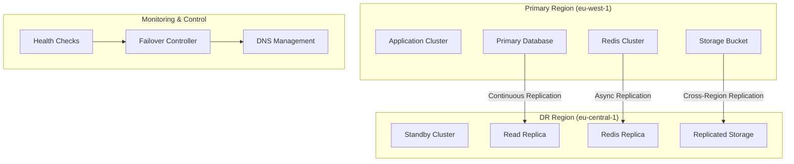

# Business Continuity Plan

## VoiceHive Hotels - Disaster Recovery & Business Continuity

### Document Information

- **Version**: 1.0
- **Last Updated**: 2024-01-01
- **Owner**: Platform Engineering Team
- **Approved By**: Engineering Manager, CTO
- **Review Frequency**: Quarterly

---

## Executive Summary

This Business Continuity Plan (BCP) outlines the procedures and strategies to ensure VoiceHive Hotels can continue operations during and after a disaster or significant disruption. The plan defines Recovery Time Objectives (RTO) and Recovery Point Objectives (RPO) for all critical systems and provides detailed procedures for various disaster scenarios.

### Key Objectives

- **RTO Target**: 30 minutes for critical services
- **RPO Target**: 5 minutes for critical data
- **Availability Target**: 99.9% uptime
- **Data Loss Tolerance**: Maximum 5 minutes of data loss

---

## Business Impact Analysis

### Critical Business Functions

| Function                 | Priority | RTO     | RPO    | Impact of Outage                               |
| ------------------------ | -------- | ------- | ------ | ---------------------------------------------- |
| Voice Call Processing    | P1       | 15 min  | 5 min  | Direct revenue loss, customer dissatisfaction  |
| Hotel PMS Integration    | P1       | 30 min  | 15 min | Operational disruption, guest service impact   |
| User Authentication      | P1       | 15 min  | 5 min  | Complete service unavailability                |
| Call Analytics           | P2       | 60 min  | 30 min | Reporting delays, business intelligence impact |
| Configuration Management | P3       | 120 min | 60 min | Administrative inconvenience                   |

### Financial Impact Assessment

| Outage Duration | Estimated Revenue Loss | Customer Impact | Regulatory Risk |
| --------------- | ---------------------- | --------------- | --------------- |
| 0-15 minutes    | $1,000                 | Minimal         | Low             |
| 15-60 minutes   | $10,000                | Moderate        | Medium          |
| 1-4 hours       | $50,000                | High            | High            |
| 4+ hours        | $200,000+              | Severe          | Critical        |

---

## Disaster Recovery Strategy

### Multi-Region Architecture



### Recovery Strategies by Component

#### Database Recovery

- **Primary Strategy**: Cross-region read replica promotion
- **Backup Strategy**: Point-in-time recovery from automated backups
- **RTO**: 15 minutes
- **RPO**: 5 minutes

#### Application Recovery

- **Primary Strategy**: Kubernetes cluster failover
- **Backup Strategy**: Blue-green deployment in DR region
- **RTO**: 30 minutes
- **RPO**: N/A (stateless)

#### Data Storage Recovery

- **Primary Strategy**: S3 cross-region replication
- **Backup Strategy**: Backup restoration from DR region
- **RTO**: 25 minutes
- **RPO**: 60 minutes

---

## Disaster Scenarios & Response Procedures

### Scenario 1: Regional Outage

**Trigger Conditions:**

- AWS region health score < 50%
- Multiple AZ failures
- Network connectivity loss to primary region

**Response Procedure:**

1. **Detection & Assessment (0-5 minutes)**

   - Automated monitoring detects regional issues
   - Incident Commander activated via PagerDuty
   - Initial impact assessment conducted

2. **Decision & Activation (5-10 minutes)**

   - Evaluate scope and expected duration
   - Decision to activate DR procedures
   - Notify stakeholders and DR team

3. **Database Failover (10-15 minutes)**

   - Promote read replica in DR region to primary
   - Update application connection strings
   - Verify database connectivity and integrity

4. **Application Failover (15-25 minutes)**

   - Scale up Kubernetes cluster in DR region
   - Deploy latest application version
   - Update load balancer and DNS records

5. **Verification & Monitoring (25-30 minutes)**
   - Execute smoke tests and health checks
   - Monitor application performance
   - Confirm full service restoration

**Rollback Procedure:**

- Reverse DNS changes
- Scale down DR region resources
- Re-establish primary region connectivity
- Sync any data changes back to primary

### Scenario 2: Database Corruption

**Trigger Conditions:**

- Database integrity check failures
- Application errors indicating data corruption
- Backup verification failures

**Response Procedure:**

1. **Immediate Response (0-5 minutes)**

   - Stop all write operations to prevent further corruption
   - Activate database administrator
   - Begin corruption scope assessment

2. **Assessment & Planning (5-15 minutes)**

   - Identify extent of corruption
   - Determine last known good backup
   - Calculate potential data loss

3. **Recovery Execution (15-45 minutes)**

   - Restore database from latest clean backup
   - Apply transaction logs up to corruption point
   - Verify data integrity and consistency

4. **Service Restoration (45-60 minutes)**
   - Gradually restore application connections
   - Execute comprehensive data validation
   - Monitor for any residual issues

### Scenario 3: Security Breach

**Trigger Conditions:**

- Security monitoring alerts
- Unauthorized access detected
- Data exfiltration indicators

**Response Procedure:**

1. **Immediate Containment (0-10 minutes)**

   - Isolate affected systems
   - Revoke potentially compromised credentials
   - Activate security incident response team

2. **Assessment & Investigation (10-30 minutes)**

   - Determine breach scope and impact
   - Identify attack vectors and compromised data
   - Preserve forensic evidence

3. **Recovery & Hardening (30-120 minutes)**

   - Restore systems from clean backups
   - Apply security patches and updates
   - Implement additional security controls

4. **Monitoring & Validation (120+ minutes)**
   - Enhanced monitoring for residual threats
   - Validate system integrity and security
   - Conduct post-incident review

---

## Roles & Responsibilities

### Incident Response Team

#### Incident Commander

- **Primary**: Platform Engineering Lead
- **Backup**: Engineering Manager
- **Responsibilities**:
  - Overall incident coordination
  - Decision making authority
  - Stakeholder communication
  - Resource allocation

#### Technical Lead

- **Primary**: Senior Platform Engineer
- **Backup**: DevOps Engineer
- **Responsibilities**:
  - Technical recovery execution
  - System restoration procedures
  - Technical decision making
  - Recovery validation

#### Communication Lead

- **Primary**: Customer Success Manager
- **Backup**: Product Manager
- **Responsibilities**:
  - Internal stakeholder updates
  - Customer communication
  - Status page management
  - Media relations (if required)

#### Database Administrator

- **Primary**: Senior Backend Engineer
- **Backup**: Platform Engineer
- **Responsibilities**:
  - Database recovery procedures
  - Data integrity validation
  - Backup management
  - Performance optimization

### Escalation Matrix

| Severity      | Response Time | Escalation Level       | Notification Method |
| ------------- | ------------- | ---------------------- | ------------------- |
| P1 (Critical) | 5 minutes     | Executive Team         | Phone + SMS + Email |
| P2 (High)     | 15 minutes    | Engineering Management | Phone + Email       |
| P3 (Medium)   | 30 minutes    | Team Leads             | Email + Slack       |
| P4 (Low)      | 60 minutes    | Assigned Engineer      | Email               |

---

## Communication Procedures

### Internal Communication

#### Immediate Notification (0-5 minutes)

- **Method**: PagerDuty + Slack
- **Recipients**: On-call engineer, Incident Commander
- **Content**: Initial alert with basic incident details

#### Status Updates (Every 15 minutes)

- **Method**: Slack + Email
- **Recipients**: Engineering team, Management
- **Content**: Current status, actions taken, next steps

#### Executive Briefing (Within 30 minutes)

- **Method**: Phone call + Email summary
- **Recipients**: CTO, CEO, VP Engineering
- **Content**: Business impact, recovery timeline, resource needs

### External Communication

#### Customer Notification

- **Trigger**: Service degradation > 15 minutes
- **Method**: Status page + Email + In-app notification
- **Timeline**: Within 30 minutes of incident start
- **Content**: Service status, expected resolution time, workarounds

#### Partner Notification

- **Trigger**: Integration services affected
- **Method**: API webhook + Email
- **Timeline**: Within 60 minutes
- **Content**: Impact assessment, integration status, timeline

### Communication Templates

#### Initial Incident Notification

```
🚨 INCIDENT ALERT - P1
Service: VoiceHive Hotels
Impact: [Brief description]
Start Time: [Timestamp]
Incident Commander: [Name]
Status Page: https://status.voicehive-hotels.com
War Room: #incident-[timestamp]
```

#### Status Update Template

```
📊 INCIDENT UPDATE - [Timestamp]
Current Status: [In Progress/Resolved/Investigating]
Actions Taken: [List of completed actions]
Next Steps: [Planned actions]
ETA: [Expected resolution time]
```

#### Resolution Notification

```
✅ INCIDENT RESOLVED - [Timestamp]
Duration: [Total incident duration]
Root Cause: [Brief explanation]
Actions Taken: [Summary of resolution steps]
Post-Mortem: [Link to detailed analysis]
```

---

## Testing & Validation

### Disaster Recovery Testing Schedule

| Test Type            | Frequency   | Duration | Participants | Success Criteria      |
| -------------------- | ----------- | -------- | ------------ | --------------------- |
| Backup Verification  | Daily       | 30 min   | Automated    | 100% backup integrity |
| Database Failover    | Weekly      | 60 min   | DB Team      | RTO < 15 min          |
| Application Failover | Monthly     | 120 min  | Full Team    | RTO < 30 min          |
| Full DR Drill        | Quarterly   | 4 hours  | All Teams    | All RTOs met          |
| Tabletop Exercise    | Bi-annually | 2 hours  | Leadership   | Process validation    |

### Test Execution Process

1. **Pre-Test Preparation**

   - Schedule test window
   - Notify stakeholders
   - Prepare test environment
   - Document baseline metrics

2. **Test Execution**

   - Execute test scenario
   - Monitor system behavior
   - Document timing and issues
   - Validate recovery procedures

3. **Post-Test Analysis**
   - Compare results to success criteria
   - Identify improvement opportunities
   - Update procedures if needed
   - Generate test report

### Success Criteria

#### Technical Metrics

- **RTO Compliance**: 95% of tests meet RTO targets
- **RPO Compliance**: 95% of tests meet RPO targets
- **Data Integrity**: 100% data consistency validation
- **Service Availability**: 99.9% uptime during recovery

#### Process Metrics

- **Communication Timeliness**: All notifications within SLA
- **Team Response**: All team members respond within 15 minutes
- **Procedure Accuracy**: 95% adherence to documented procedures
- **Decision Speed**: Critical decisions made within 10 minutes

---

## Continuous Improvement

### Post-Incident Review Process

1. **Immediate Review (Within 24 hours)**

   - Timeline reconstruction
   - Initial lessons learned
   - Immediate action items

2. **Detailed Analysis (Within 1 week)**

   - Root cause analysis
   - Process evaluation
   - Technology assessment

3. **Improvement Planning (Within 2 weeks)**
   - Action item prioritization
   - Resource allocation
   - Implementation timeline

### Key Performance Indicators

| KPI                           | Target       | Measurement Frequency |
| ----------------------------- | ------------ | --------------------- |
| Mean Time to Detection (MTTD) | < 5 minutes  | Monthly               |
| Mean Time to Recovery (MTTR)  | < 30 minutes | Monthly               |
| Recovery Success Rate         | > 95%        | Quarterly             |
| Test Success Rate             | > 90%        | Monthly               |
| Backup Success Rate           | > 99%        | Daily                 |

### Improvement Tracking

- **Monthly Reviews**: KPI analysis and trend identification
- **Quarterly Assessments**: Comprehensive plan evaluation
- **Annual Updates**: Full plan revision and approval
- **Continuous Monitoring**: Real-time metrics and alerting

---

## Appendices

### Appendix A: Contact Information

[Emergency contact details for all team members and external vendors]

### Appendix B: System Dependencies

[Detailed mapping of system interdependencies and external services]

### Appendix C: Recovery Procedures

[Step-by-step technical procedures for each recovery scenario]

### Appendix D: Vendor Contacts

[Emergency contacts for all critical vendors and service providers]

### Appendix E: Compliance Requirements

[Regulatory and compliance considerations for disaster recovery]

---

**Document Control**

- **Next Review Date**: 2024-04-01
- **Distribution**: Engineering Team, Management, Security Team
- **Classification**: Internal Use Only
- **Retention Period**: 7 years
