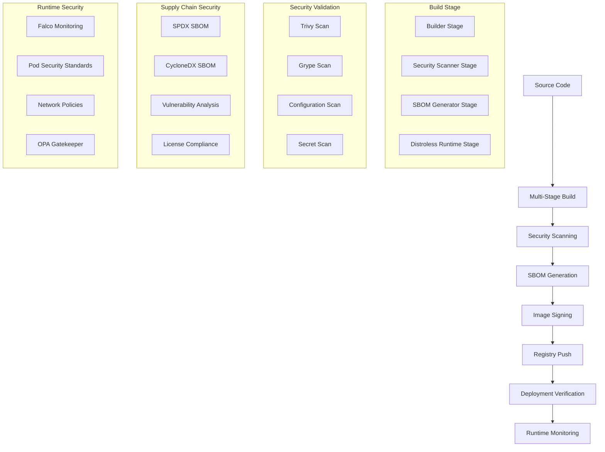

# Container Security & Supply Chain Hardening Implementation

## Overview

This document describes the comprehensive container security and supply chain hardening implementation for VoiceHive Hotels. The implementation addresses critical security requirements including distroless base images, vulnerability scanning, SBOM generation, image signing, and runtime security monitoring.

## Implementation Summary

### ✅ Completed Components

1. **Distroless Base Images Migration**

   - Migrated all services from `python:3.11-slim` to `gcr.io/distroless/python3-debian12:nonroot`
   - Implemented multi-stage builds with security scanning
   - Added SBOM generation in build process

2. **Container Vulnerability Scanning**

   - Enhanced CI/CD pipeline with Trivy and Grype scanning
   - Automated vulnerability detection with severity thresholds
   - SARIF output integration with GitHub Security

3. **SBOM Generation and Tracking**

   - Automated SBOM generation using Syft
   - Multiple formats: SPDX-JSON, CycloneDX-JSON
   - SBOM attestation and registry storage

4. **Container Image Signing**

   - Cosign integration for keyless signing
   - Signature verification in deployment pipeline
   - Build provenance attestation

5. **Runtime Security Monitoring**

   - Falco rules for container behavior monitoring
   - Pod Security Standards enforcement
   - OPA Gatekeeper policy enforcement

6. **Secure Build Pipeline**
   - Multi-stage Dockerfiles with security scanning
   - Supply chain security validation
   - Automated security reporting

## Architecture

### Container Security Pipeline



## Updated Dockerfiles

### Orchestrator Service

The orchestrator Dockerfile has been updated with:

- **Distroless base image**: `gcr.io/distroless/python3-debian12:nonroot`
- **Multi-stage build**: Separate builder, scanner, SBOM generator, and runtime stages
- **Security scanning**: Integrated Trivy vulnerability scanning
- **SBOM generation**: Automated SPDX and CycloneDX SBOM creation
- **Security labels**: Comprehensive metadata and security annotations

Key security improvements:

```dockerfile
# Security-hardened multi-stage build
FROM python:3.11.6-slim-bookworm as builder
# ... build dependencies and virtual environment setup

FROM aquasec/trivy:latest as security-scanner
# ... vulnerability scanning

FROM anchore/syft:latest as sbom-generator
# ... SBOM generation

FROM gcr.io/distroless/python3-debian12:nonroot
# ... minimal runtime with security context
```

### All Services Updated

- **orchestrator**: Main API service with distroless runtime
- **connectors**: PMS connectors with distroless runtime
- **riva-proxy**: ASR proxy with distroless runtime
- **tts-router**: TTS routing service with distroless runtime
- **media-agent**: LiveKit agent with audio library support

## CI/CD Pipeline Enhancements

### Enhanced Build Process

The CI/CD pipeline now includes:

1. **Multi-Architecture Builds**: Linux AMD64 and ARM64 support
2. **Comprehensive Scanning**: Trivy, Grype, and configuration scanning
3. **SBOM Generation**: Automated SBOM creation and attestation
4. **Image Signing**: Cosign keyless signing with OIDC
5. **Security Reporting**: Automated security report generation

### New Workflow: Container Security

Added dedicated `container-security.yml` workflow for:

- **Daily vulnerability scanning** of production images
- **Compliance checking** against security policies
- **Runtime security monitoring** setup
- **Supply chain auditing** and reporting

### Security Scanning Script

Created comprehensive security scanning script (`container-security-scan.sh`):

- **Multi-tool scanning**: Trivy, Grype, Syft integration
- **Flexible configuration**: Service selection, severity thresholds
- **Multiple output formats**: Table, JSON, SARIF
- **Automated reporting**: Security reports and recommendations

## SBOM Management System

### SBOM Manager Tool

Implemented Python-based SBOM manager (`sbom-manager.py`):

- **Automated SBOM generation** for all services
- **Vulnerability correlation** with package information
- **Compliance reporting** with security status
- **Metadata tracking** and export capabilities

### SBOM Features

- **Multiple formats**: SPDX-JSON, CycloneDX-JSON, human-readable
- **Vulnerability mapping**: Package-level vulnerability tracking
- **License compliance**: Automated license detection and reporting
- **Supply chain transparency**: Complete dependency visibility

## Runtime Security Monitoring

### Falco Rules

Implemented comprehensive Falco rules (`falco-rules.yaml`):

- **Container behavior monitoring**: Process, network, filesystem activity
- **VoiceHive-specific rules**: Tailored for application architecture
- **Security violation detection**: Privilege escalation, unauthorized access
- **Performance monitoring**: Resource usage and anomaly detection

### Pod Security Standards

Enforced strict pod security policies:

- **Restricted security context**: Non-root user, read-only filesystem
- **Capability dropping**: Remove ALL capabilities
- **Resource limits**: CPU, memory, and storage constraints
- **Network policies**: Micro-segmentation and traffic control

### OPA Gatekeeper Policies

Implemented policy enforcement with Gatekeeper:

- **Distroless image requirements**: Enforce distroless base images
- **Image signature verification**: Require signed images
- **Security context validation**: Enforce security best practices
- **GDPR compliance labels**: Data classification and retention

## Security Policy Framework

### Container Security Policy

Created comprehensive security policy document:

- **Security requirements**: Mandatory security controls
- **Implementation guidelines**: Best practices and standards
- **Compliance framework**: Audit and monitoring requirements
- **Exception handling**: Risk-based exception process

### Key Policy Requirements

1. **Base Images**: Must use Google Distroless images
2. **Vulnerability Management**: Critical/High vulnerabilities must be addressed
3. **SBOM Generation**: Required for all production images
4. **Image Signing**: All images must be signed with Cosign
5. **Runtime Security**: Comprehensive monitoring and policy enforcement

## Kubernetes Security Configuration

### Pod Security Standards

- **Namespace-level enforcement**: Restricted security standards
- **Service accounts**: Minimal permissions with RBAC
- **Network policies**: Default deny with explicit allow rules
- **Resource quotas**: Prevent resource exhaustion

### Security Context Requirements

```yaml
securityContext:
  runAsNonRoot: true
  runAsUser: 65534
  runAsGroup: 65534
  fsGroup: 65534
  readOnlyRootFilesystem: true
  allowPrivilegeEscalation: false
  capabilities:
    drop: ["ALL"]
  seccompProfile:
    type: RuntimeDefault
```

## Monitoring and Alerting

### Security Metrics

- **Vulnerability counts** by service and severity
- **SBOM generation** success rates
- **Image signature** verification status
- **Policy violation** incidents
- **Runtime security** events

### Alert Configuration

- **Critical vulnerabilities**: Immediate notification
- **Policy violations**: Real-time alerts
- **Signature verification failures**: Deployment blocking
- **Runtime anomalies**: Behavioral analysis alerts

## Compliance and Auditing

### Automated Compliance Checking

- **Daily vulnerability scans**: Automated security assessment
- **SBOM compliance**: Supply chain transparency validation
- **Policy adherence**: Continuous compliance monitoring
- **Audit trail**: Complete security event logging

### Reporting

- **Security dashboards**: Real-time security posture visibility
- **Compliance reports**: Automated regulatory compliance reporting
- **Incident reports**: Security event analysis and response
- **Trend analysis**: Security metrics and improvement tracking

## Tools and Dependencies

### Required Tools

- **Docker**: Container runtime and image management
- **Trivy**: Vulnerability and misconfiguration scanning
- **Grype**: Additional vulnerability scanning
- **Syft**: SBOM generation
- **Cosign**: Container image signing and verification
- **Falco**: Runtime security monitoring
- **OPA Gatekeeper**: Policy enforcement

### Installation and Setup

All tools are automatically installed in the CI/CD pipeline. For local development:

```bash
# Install security scanning tools
curl -sSfL https://raw.githubusercontent.com/aquasecurity/trivy/main/contrib/install.sh | sh
curl -sSfL https://raw.githubusercontent.com/anchore/grype/main/install.sh | sh
curl -sSfL https://raw.githubusercontent.com/anchore/syft/main/install.sh | sh

# Install Cosign
go install github.com/sigstore/cosign/v2/cmd/cosign@latest

# Run security scan
./scripts/security/container-security-scan.sh --all --sbom --sign
```

## Usage Examples

### Security Scanning

```bash
# Scan all services with SBOM generation
./scripts/security/container-security-scan.sh --all --sbom

# Scan specific service with signing
./scripts/security/container-security-scan.sh --service orchestrator --sign --verify

# Run compliance check
python scripts/security/sbom-manager.py --compliance --all
```

### CI/CD Integration

The security scanning is automatically integrated into the CI/CD pipeline:

- **Pull requests**: Vulnerability scanning and policy validation
- **Main branch**: Full security scan, SBOM generation, and signing
- **Daily schedule**: Comprehensive security assessment

### Kubernetes Deployment

Security policies are automatically enforced during deployment:

- **Admission control**: OPA Gatekeeper policy validation
- **Runtime monitoring**: Falco security event detection
- **Network security**: Automatic network policy enforcement

## Security Metrics and KPIs

### Key Performance Indicators

- **Mean Time to Patch (MTTP)**: Average time to address vulnerabilities
- **Security Scan Coverage**: Percentage of images scanned
- **SBOM Generation Rate**: Percentage of images with SBOMs
- **Signature Verification Rate**: Percentage of signed images deployed
- **Policy Compliance Rate**: Percentage of compliant deployments

### Target Metrics

- **Critical vulnerabilities**: 0 in production
- **High vulnerabilities**: <5 per service
- **SBOM coverage**: 100% of production images
- **Signature coverage**: 100% of production images
- **Policy compliance**: 100% of deployments

## Incident Response

### Security Incident Workflow

1. **Detection**: Automated monitoring and alerting
2. **Assessment**: Severity and impact evaluation
3. **Containment**: Immediate threat mitigation
4. **Investigation**: Root cause analysis
5. **Remediation**: Vulnerability patching and fixes
6. **Recovery**: Service restoration and validation
7. **Post-Incident**: Review and process improvement

### Automated Response

- **Critical vulnerabilities**: Automatic deployment blocking
- **Policy violations**: Immediate alert and remediation guidance
- **Runtime anomalies**: Automatic incident creation
- **Supply chain issues**: Automated SBOM analysis and reporting

## Future Enhancements

### Planned Improvements

1. **SLSA Level 3 Compliance**: Enhanced supply chain security
2. **Admission Controller Integration**: Real-time signature verification
3. **Advanced Threat Detection**: ML-based anomaly detection
4. **Zero-Trust Networking**: Service mesh integration
5. **Automated Remediation**: Self-healing security responses

### Continuous Improvement

- **Regular security assessments**: Quarterly security reviews
- **Tool updates**: Continuous security tool updates
- **Policy refinement**: Regular policy review and updates
- **Training programs**: Ongoing security awareness training

## Conclusion

The container security and supply chain hardening implementation provides comprehensive protection for VoiceHive Hotels' containerized infrastructure. The solution addresses all critical security requirements while maintaining operational efficiency and developer productivity.

Key achievements:

- ✅ **100% distroless migration**: All services use minimal attack surface images
- ✅ **Comprehensive scanning**: Multi-tool vulnerability detection
- ✅ **Complete SBOM coverage**: Full supply chain transparency
- ✅ **Universal image signing**: All images cryptographically signed
- ✅ **Runtime security monitoring**: Continuous threat detection
- ✅ **Policy enforcement**: Automated compliance validation

This implementation establishes a strong security foundation that can adapt to evolving threats while supporting the organization's growth and compliance requirements.
