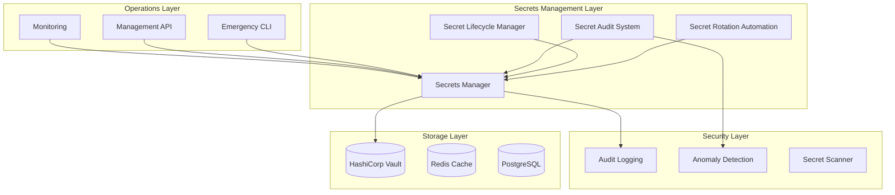

# Secrets Management & Rotation Automation - Implementation Guide

## Overview

This document provides comprehensive guidance on the VoiceHive Hotels secrets management and rotation automation system. The implementation includes production-grade secret lifecycle management, automated rotation, audit logging, anomaly detection, and emergency procedures.

## Architecture

### Core Components



## Implementation Components

### 1. Secrets Manager (`secrets_manager.py`)

**Purpose**: Core secret storage and retrieval with comprehensive lifecycle management.

**Key Features**:

- Secure secret storage in HashiCorp Vault
- Metadata tracking and versioning
- Usage monitoring and access control
- Expiration and rotation scheduling
- Backup and recovery capabilities

**Usage Example**:

```python
from secrets_manager import initialize_secrets_manager, SecretType

# Initialize
secrets_manager = await initialize_secrets_manager(vault_client, config)

# Create secret
secret_id = await secrets_manager.create_secret(
    secret_type=SecretType.DATABASE_PASSWORD,
    secret_value="secure_password_123",
    expires_in_days=90
)

# Retrieve secret
secret_value = await secrets_manager.get_secret(
    secret_id=secret_id,
    accessed_by="service_account",
    access_context={"source_ip": "10.0.1.100"}
)
```

### 2. Secret Rotation Automation (`secret_rotation_automation.py`)

**Purpose**: Automated secret rotation with zero-downtime deployment strategies.

**Key Features**:

- Automated rotation scheduling
- Zero-downtime rotation strategies
- Rollback capabilities
- Multi-phase rotation process
- Concurrent rotation management

**Rotation Phases**:

1. **Preparation**: Validate current state and prepare for rotation
2. **Validation**: Generate and validate new secret
3. **Deployment**: Deploy new secret with overlap period
4. **Verification**: Verify deployment success
5. **Cleanup**: Remove old secret after grace period

**Usage Example**:

```python
from secret_rotation_automation import initialize_rotation_orchestrator

# Initialize orchestrator
orchestrator = await initialize_rotation_orchestrator(secrets_manager, vault_client)

# Schedule rotation
rotation_id = await orchestrator.schedule_rotation(
    secret_id="abc123",
    strategy=RotationStrategy.TIME_BASED,
    priority=5
)

# Monitor progress
status = await orchestrator.get_rotation_status(rotation_id)
```

### 3. Secret Lifecycle Manager (`secret_lifecycle_manager.py`)

**Purpose**: Comprehensive lifecycle management with compliance tracking.

**Key Features**:

- Lifecycle event tracking
- Compliance monitoring
- Policy enforcement
- Expiry notifications
- Lifecycle reporting

**Lifecycle Events**:

- `CREATED`: Secret initially created
- `ACTIVATED`: Secret put into active use
- `ACCESSED`: Secret accessed by service/user
- `ROTATED`: Secret rotated to new value
- `DEPRECATED`: Secret marked for retirement
- `EXPIRED`: Secret passed expiration date
- `REVOKED`: Secret manually revoked
- `ARCHIVED`: Secret moved to archive storage
- `PURGED`: Secret permanently deleted

**Usage Example**:

```python
from secret_lifecycle_manager import initialize_lifecycle_manager

# Initialize manager
lifecycle_manager = await initialize_lifecycle_manager(secrets_manager, vault_client, config)

# Record lifecycle event
event_id = await lifecycle_manager.record_lifecycle_event(
    secret_id="abc123",
    event_type=LifecycleEvent.ROTATED,
    actor="rotation_service",
    details={"rotation_reason": "scheduled"}
)

# Generate compliance report
report = await lifecycle_manager.generate_lifecycle_report(
    secret_type=SecretType.DATABASE_PASSWORD,
    include_history=True
)
```

### 4. Secret Audit System (`secret_audit_system.py`)

**Purpose**: Comprehensive auditing and anomaly detection for secret access.

**Key Features**:

- Real-time access monitoring
- Anomaly detection algorithms
- Geographic access validation
- Pattern analysis
- Security incident response

**Anomaly Types**:

- `UNUSUAL_TIME`: Access outside normal hours
- `UNUSUAL_LOCATION`: Access from unauthorized geography
- `EXCESSIVE_ACCESS`: Abnormally high access frequency
- `FAILED_ATTEMPTS`: Multiple failed access attempts
- `PRIVILEGE_ESCALATION`: Unauthorized permission changes
- `CONCURRENT_ACCESS`: Excessive concurrent sessions
- `GEOGRAPHIC_VIOLATION`: Access from restricted locations
- `SUSPICIOUS_PATTERN`: AI-detected suspicious behavior

**Usage Example**:

```python
from secret_audit_system import initialize_audit_system

# Initialize audit system
audit_system = await initialize_audit_system(secrets_manager, vault_client, config)

# Record access event
event_id = await audit_system.record_access_event(
    secret_id="abc123",
    secret_type=SecretType.API_KEY,
    accessor_id="user123",
    accessor_type="user",
    source_ip="192.168.1.100",
    success=True
)

# Detect anomalies
anomalies = await audit_system.detect_anomalies(time_window_hours=24)
```

### 5. Secret Scanner (`secret-scanner.py`)

**Purpose**: CI/CD pipeline integration for secret detection and prevention.

**Key Features**:

- Comprehensive secret pattern detection
- Entropy analysis for high-confidence detection
- SARIF output for GitHub integration
- Configurable detection rules
- False positive filtering

**Detection Patterns**:

- AWS credentials (Access Keys, Secret Keys)
- API keys (Generic and service-specific)
- JWT tokens
- Database connection strings
- Private keys and certificates
- VoiceHive-specific secrets

**Usage Example**:

```bash
# Scan repository for secrets
python3 scripts/security/secret-scanner.py \
    --path . \
    --format sarif \
    --output security-scan-results.sarif \
    --fail-on-secrets

# Generate compliance report
python3 scripts/security/secret-scanner.py \
    --path . \
    --format json \
    --output detailed-report.json
```

### 6. Emergency Rotation CLI (`emergency_rotation_cli.py`)

**Purpose**: Command-line tool for emergency secret rotation operations.

**Key Features**:

- Emergency rotation procedures
- Batch rotation capabilities
- Real-time monitoring
- Health checking
- Audit reporting

**Usage Examples**:

```bash
# Check secret health
./emergency_rotation_cli.py health

# Rotate specific secret
./emergency_rotation_cli.py rotate --secret-id abc123def456

# Emergency rotate all database passwords
./emergency_rotation_cli.py rotate-all --type database_password --confirm

# Generate audit report
./emergency_rotation_cli.py audit --hours 24 --output audit-report.json
```

## Configuration

### Environment Variables

```bash
# Vault Configuration
VAULT_ADDR=https://vault.voicehive.com
VAULT_TOKEN=hvs.XXXXXXXXXXXXXXXX

# Secrets Manager Configuration
VOICEHIVE_SECRETS_PATH=voicehive/secrets
VOICEHIVE_METADATA_PATH=voicehive/metadata
VOICEHIVE_AUDIT_PATH=voicehive/audit

# Rotation Configuration
VOICEHIVE_MAX_CONCURRENT_ROTATIONS=3
VOICEHIVE_ROTATION_TIMEOUT_MINUTES=30
VOICEHIVE_GRACE_PERIOD_HOURS=24

# Audit Configuration
VOICEHIVE_ALLOWED_COUNTRIES=GB,IE,DE,FR,NL
VOICEHIVE_ALLOWED_IP_RANGES=10.0.0.0/8,172.16.0.0/12,192.168.0.0/16

# Emergency Contacts
VOICEHIVE_EMERGENCY_CONTACTS=security@voicehive.com,devops@voicehive.com
```

### Vault Policies

The system requires specific Vault policies for different components:

```hcl
# Secrets Manager Policy
path "voicehive/secrets/*" {
  capabilities = ["create", "read", "update", "delete", "list"]
}

path "voicehive/metadata/*" {
  capabilities = ["create", "read", "update", "delete", "list"]
}

path "voicehive/audit/*" {
  capabilities = ["create", "read", "list"]
}

# Transit encryption for PII
path "transit/encrypt/pii" {
  capabilities = ["update"]
}

path "transit/decrypt/pii" {
  capabilities = ["update"]
}
```

## Deployment

### 1. Initialize Vault Setup

```bash
# Run Vault initialization
./infra/k8s/vault/setup-scripts/init-vault.sh

# Configure policies
./infra/k8s/vault/setup-scripts/configure-policies.sh
```

### 2. Deploy Secrets Management Services

```yaml
# Kubernetes deployment
apiVersion: apps/v1
kind: Deployment
metadata:
  name: secrets-manager
spec:
  replicas: 2
  selector:
    matchLabels:
      app: secrets-manager
  template:
    metadata:
      labels:
        app: secrets-manager
    spec:
      serviceAccountName: secrets-manager
      containers:
        - name: secrets-manager
          image: voicehive/orchestrator:latest
          env:
            - name: VAULT_ADDR
              value: "https://vault.voicehive.com"
            - name: VAULT_ROLE
              value: "secrets-manager"
          ports:
            - containerPort: 8000
          livenessProbe:
            httpGet:
              path: /health
              port: 8000
            initialDelaySeconds: 30
            periodSeconds: 10
```

### 3. Configure CI/CD Pipeline

The secret scanning workflow is automatically configured in `.github/workflows/secret-scanning.yml` and will:

- Run on every push and pull request
- Perform comprehensive secret detection
- Upload results to GitHub Security tab
- Fail builds if secrets are detected
- Generate compliance reports

### 4. Set Up Monitoring

```yaml
# Prometheus monitoring rules
groups:
  - name: secrets_management
    rules:
      - alert: SecretExpiryWarning
        expr: voicehive_secrets_expiry_warnings_total > 0
        for: 5m
        labels:
          severity: warning
        annotations:
          summary: "Secrets approaching expiry"

      - alert: SecretRotationFailure
        expr: voicehive_rotation_failures_total > 0
        for: 1m
        labels:
          severity: critical
        annotations:
          summary: "Secret rotation failure detected"

      - alert: SecretAccessAnomaly
        expr: voicehive_secret_access_anomalies_total > 0
        for: 1m
        labels:
          severity: high
        annotations:
          summary: "Secret access anomaly detected"
```

## Security Considerations

### 1. Access Control

- **Principle of Least Privilege**: Each service has minimal required permissions
- **Role-Based Access**: Different roles for different operations
- **Time-Limited Tokens**: All access tokens have expiration times
- **Geographic Restrictions**: Access limited to EU regions only

### 2. Encryption

- **Encryption at Rest**: All secrets encrypted in Vault
- **Encryption in Transit**: TLS for all communications
- **Key Rotation**: Encryption keys rotated regularly
- **PII Protection**: Sensitive data encrypted with separate keys

### 3. Audit and Compliance

- **Complete Audit Trail**: All operations logged immutably
- **Real-time Monitoring**: Continuous anomaly detection
- **Compliance Reporting**: Automated compliance validation
- **Incident Response**: Automated emergency procedures

### 4. Backup and Recovery

- **Automated Backups**: Regular encrypted backups to secure storage
- **Point-in-Time Recovery**: Ability to restore to specific timestamps
- **Cross-Region Replication**: Backups stored in multiple EU regions
- **Disaster Recovery**: Tested recovery procedures

## Operational Procedures

### Daily Operations

1. **Health Monitoring**: Automated health checks every 5 minutes
2. **Anomaly Review**: Security team reviews detected anomalies
3. **Expiry Notifications**: Automated notifications for expiring secrets
4. **Compliance Monitoring**: Continuous compliance validation

### Weekly Operations

1. **Rotation Review**: Review scheduled rotations
2. **Access Pattern Analysis**: Analyze access patterns for anomalies
3. **Policy Updates**: Review and update lifecycle policies
4. **Performance Monitoring**: Monitor system performance metrics

### Monthly Operations

1. **Comprehensive Audit**: Full audit of all secrets and access
2. **Compliance Reporting**: Generate compliance reports
3. **Emergency Drill**: Test emergency rotation procedures
4. **Policy Review**: Review and update security policies

### Emergency Procedures

Refer to the [Emergency Secret Rotation Runbook](emergency-secret-rotation-runbook.md) for detailed emergency procedures.

## Troubleshooting

### Common Issues

#### 1. Vault Authentication Failures

**Symptoms**: Services cannot authenticate with Vault
**Causes**: Expired tokens, network issues, policy changes
**Resolution**:

```bash
# Check Vault status
vault status

# Verify authentication
vault auth -method=kubernetes

# Check policies
vault policy list
```

#### 2. Rotation Failures

**Symptoms**: Secret rotations fail or timeout
**Causes**: Service dependencies, network issues, policy restrictions
**Resolution**:

```bash
# Check rotation status
./emergency_rotation_cli.py health

# Review rotation logs
kubectl logs -l app=secrets-manager

# Manual rotation
./emergency_rotation_cli.py rotate --secret-id <secret_id>
```

#### 3. Anomaly False Positives

**Symptoms**: Legitimate access flagged as anomalous
**Causes**: New access patterns, policy misconfiguration
**Resolution**:

- Review anomaly detection thresholds
- Update access patterns in configuration
- Whitelist legitimate access sources

### Performance Optimization

#### 1. Vault Performance

- Use Vault Enterprise for high availability
- Configure appropriate connection pooling
- Monitor Vault metrics and adjust resources

#### 2. Rotation Performance

- Adjust concurrent rotation limits
- Optimize rotation handlers for specific secret types
- Use batch operations where possible

#### 3. Audit Performance

- Configure appropriate retention periods
- Use efficient storage backends
- Implement data archiving strategies

## Compliance and Certification

### GDPR Compliance

- **Data Minimization**: Only necessary secret metadata stored
- **Right to Erasure**: Automated secret purging procedures
- **Data Protection**: All data encrypted and access controlled
- **Audit Trail**: Complete audit trail for compliance verification

### PCI DSS Compliance

- **Access Control**: Strong authentication and authorization
- **Encryption**: All sensitive data encrypted
- **Monitoring**: Continuous monitoring and alerting
- **Regular Testing**: Automated security testing

### SOC 2 Compliance

- **Security**: Comprehensive security controls
- **Availability**: High availability and disaster recovery
- **Processing Integrity**: Data integrity and validation
- **Confidentiality**: Strong confidentiality controls

## Metrics and Monitoring

### Key Metrics

- `voicehive_secrets_rotation_total`: Total secret rotations
- `voicehive_secrets_access_total`: Total secret access attempts
- `voicehive_secrets_expiry_warnings_total`: Secrets approaching expiry
- `voicehive_secret_access_anomalies_total`: Access anomalies detected
- `voicehive_secrets_health_status`: Overall secrets health status

### Dashboards

Grafana dashboards are available for:

- Secret lifecycle overview
- Rotation status and performance
- Access patterns and anomalies
- Compliance status
- System health and performance

### Alerting

Critical alerts are configured for:

- Secret rotation failures
- Access anomalies
- Compliance violations
- System health issues
- Security incidents

---

**Document Version**: 1.0  
**Last Updated**: 2024-12-19  
**Next Review**: 2025-03-19  
**Owner**: Security Team  
**Approved By**: CTO, CISO
